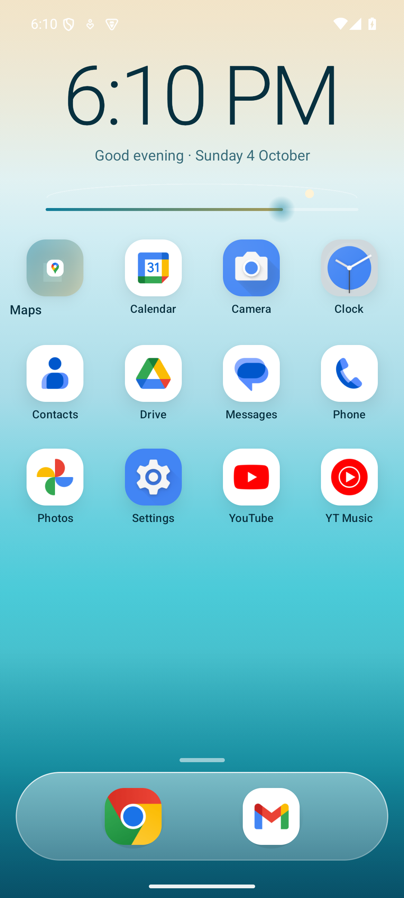
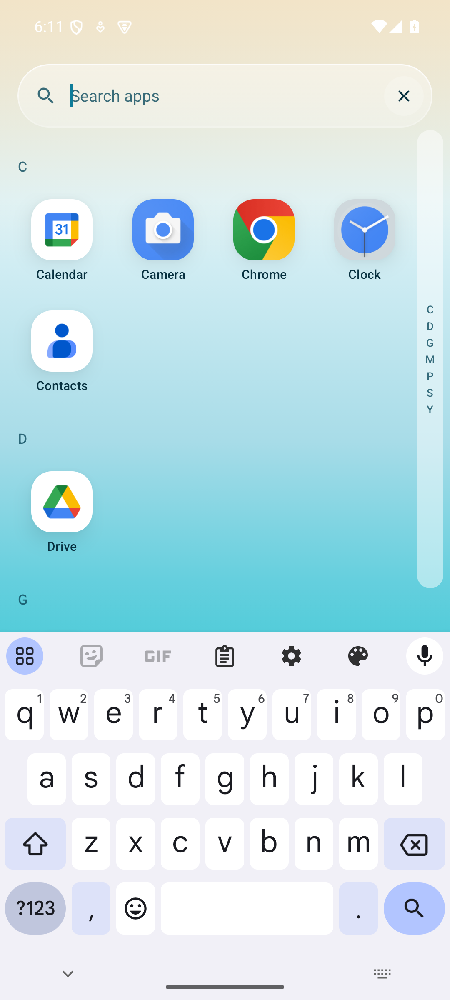
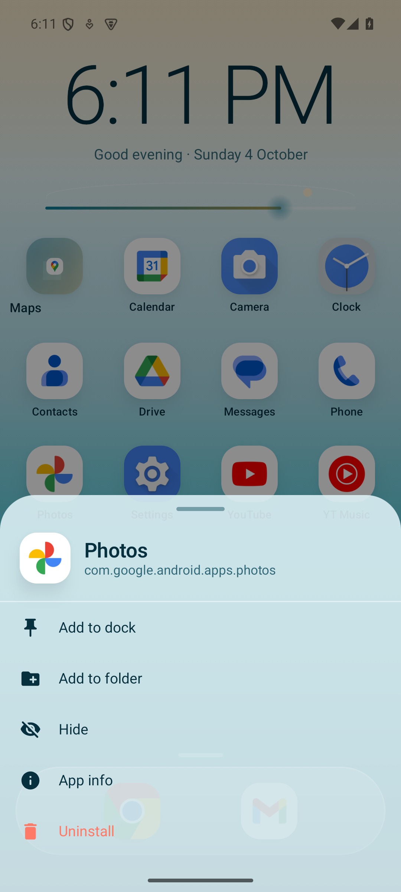
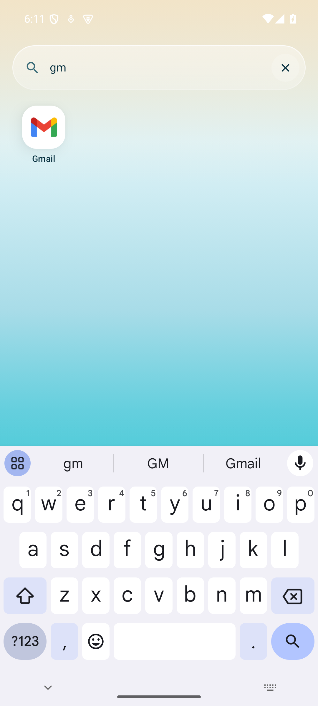
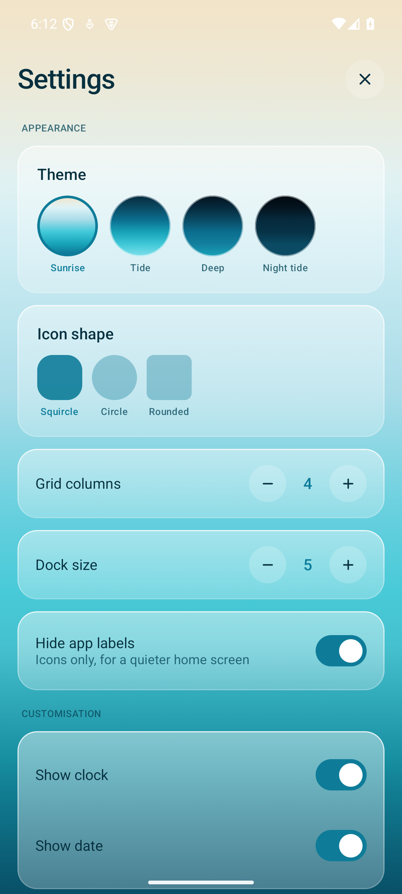
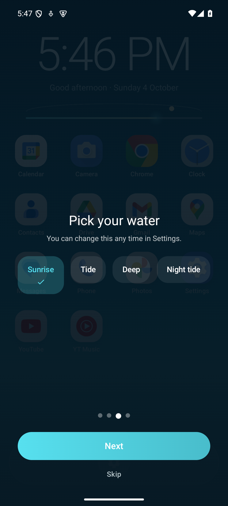

<div align="center">

# Tide

**An Android home-screen launcher built around moving water.**

<p align="center">
  
  
  
</p>

<p align="center">
  
  
  
</p>

[](https://github.com/loak7993-code/tide/actions/workflows/build.yml)
[](https://github.com/loak7993-code/tide/releases/latest)
[](LICENSE)
[](https://kotlinlang.org)
[](https://developer.android.com/jetpack/compose)
[](https://developer.android.com/about/versions/oreo)
[](https://developer.android.com/about/versions)

</div>

---

## What it is

Most launchers treat the background as wallpaper — a still image or a flat fill.
Tide treats it as the product. The water is a live, layered composition: a depth
gradient, a sun sitting below the surface, caustic pools drifting on different
periods, and a swell moving across the horizon. Everything else floats on top of
it as glass.

The result is a launcher that never looks the same twice, but is also never
busy enough to compete with the icons on top of it.

## Features

| | |
|---|---|
| **Home screen** | App grid plus a hotseat dock, both persisted across restarts. |
| **Dock reordering** | Long-press a dock icon and drag; a long press without movement opens its menu. |
| **Folders** | Group apps into a named folder; tap to open, rename or dissolve it. |
| **App drawer** | Letter headers and an A–Z jump rail, reachable by swiping the clock. |
| **Fuzzy search** | Subsequence matching — `gm` finds *Gmail*, `ch` finds *Chrome* and *Clock*. |
| **Long press** | Pin to dock, file into a folder, hide, app info, uninstall, declared shortcuts. |
| **Home menu** | Long-press empty space for *Add widget* and *Home screen settings*. |
| **Widgets** | Lists every installed widget provider and hosts the ones you place. |
| **App-open animation** | The tapped icon itself grows from its own position to fill the screen, over a fading scrim, then hands off. Not an instant cut. |
| **Ocean motion** | Layered animated background; can be switched off, or dialled from nothing to full drift. |
| **Four themes** | Sunrise (light), Tide, Deep, Night tide — each a full palette, not a hue rotation. |
| **Icon shapes** | Squircle, circle or rounded, applied live without re-rasterising. |
| **Undo** | Hiding or unpinning is reversible from the notice bar. |
| **Frame overlay** | Optional live FPS, p95 frame time, jank percentage and heap usage. |
| **Onboarding** | Four steps on first launch: what Tide is, the gestures that are not discoverable by looking, a theme picked against the live background, and a ready state. |
| **Customisation** | Clock and date on or off, 12/24-hour or follow-the-device, icon size, label size, motion intensity and glass opacity — all live. |

## Install

**[](https://github.com/loak7993-code/tide/releases/download/v1.0.0/tide-1.0.0.apk)
([releases](https://github.com/loak7993-code/tide/releases/latest))**

Requires Android 8.0 (API 26) or newer. The published APK is signed with the
**debug key** — it installs and runs, but supply a `keystore.properties` to
produce a Play-ready signed build.

Or build it yourself:

```bash
git clone https://github.com/loak7993-code/tide.git
cd tide
echo "sdk.dir=$ANDROID_HOME" > local.properties
./gradlew :app:assembleDebug
adb install -r app/build/outputs/apk/debug/app-debug.apk
```

Then make it the home app:

```bash
adb shell cmd package set-home-activity \
  app.tide.launcher.debug/app.tide.launcher.MainActivity
```

> Requires **JDK 17+** and **compileSdk 36**. `minSdk` is 26 — adaptive icons
> are what let the grid render every app on one mask instead of a mix of legacy
> squares, and they landed in Android 8.

## How it works

A few decisions that are not obvious from the file list.

**Icons are rasterised once, into bitmaps.** `PackageManager.getActivityIcon`
returns a `Drawable`, which carries mutable bounds and alpha — sharing one
instance across grid cells that lay it out at different sizes corrupts it.
`IconCache` flattens every icon to an immutable `ImageBitmap` and keeps them in
an LRU, so scrolling never touches the `PackageManager`.

**Adaptive icons are composited unmasked.** `AdaptiveIconDrawable.draw()` applies
its own OEM mask, which would fight the icon-shape setting. Background and
foreground layers are flattened full-bleed instead and the shape is applied at
draw time — so switching shapes is instant rather than a re-rasterise.

**The ocean renders offscreen at a third resolution.** A depth gradient, a glow,
three caustic pools, a shimmer and a vignette is six large fills per frame, four
of them radial — and a radial gradient evaluates a `sqrt` per pixel. At
1080×2400 that is ~15M shader invocations per frame: fine on a phone GPU, and
enough to ANR a software renderer outright. Rendering the same layers into a
third-resolution buffer and blitting up with bilinear filtering cuts the
gradient work by ~9×. On something this smooth the upscale is invisible, so
downsampling is the correct tool rather than a compromise.

**Gradients are built once, then translated.** Within the low-resolution pass,
every shader is created once per palette; the animation only moves the canvas.
The animated values are read inside the draw lambda so they invalidate the draw
phase and never trigger recomposition.

**Gestures are deliberately conservative.** Swipe-up lives on the clock, not on
the grid. A vertical drag recogniser on a scrollable list either fights the
scroll or silently stops working once scrolled — both feel broken. Confining it
to a zone where it is always available and never ambiguous is the better trade.

**Search scoring is weighted, not boolean.** Consecutive runs, word boundaries,
prefix matches and exact labels each carry a different weight, so `ca` ranks
*Calendar* above an incidental subsequence match. Covered by
[21 unit tests](app/src/test/java/app/tide/launcher/data/FuzzyTest.kt).

## Releasing

`assembleRelease` runs R8 in full mode with resource shrinking. The rules in
[`proguard-rules.pro`](app/proguard-rules.pro) cover the three things that
actually break when minified: kotlinx.serialization's generated serializers,
DataStore's protobuf descriptors, and enums that round-trip through preferences
by name.

To sign a real release, drop a `keystore.properties` in the project root:

```properties
storeFile=/path/to/release.jks
storePassword=...
keyAlias=...
keyPassword=...
```

Without it, `assembleRelease` falls back to the debug key so the build still
produces an installable artifact. That file and any `*.jks` are gitignored.

## Project layout

```
app/src/main/java/app/tide/launcher/
├── core/          LauncherActions, Haptics, AppShortcuts
├── data/          AppRepository, IconCache, SettingsStore, Fuzzy, Folder
├── debug/         TideLog, DebugOverlay
├── ui/
│   ├── components/ OceanBackground, AppIconTile, GlassSurface,
│   │               AppMenuSheet, FolderSheet, FolderPickerSheet, HomeMenuSheet
│   ├── drawer/     DrawerScreen
│   ├── home/       HomeSurface, ClockWidget
│   ├── settings/   SettingsScreen
│   ├── theme/      OceanPalette, Motion, Type, Shape
│   └── widgets/    WidgetHostController, WidgetArea
└── ui/            LauncherViewModel, TideLauncherScreen
```

### A note on the dock gesture

Long-pressing a dock icon has to do two things: start a drag, *and* open the
menu if the user just wanted to look at it. These are the same gesture, so they
share **one** recogniser — `combinedClickable`'s `onLongClick` is deliberately
absent, because it and `detectDragGesturesAfterLongPress` both fire on the same
hold and whichever ran first would win. Instead the drag recogniser owns the
gesture, and a release without movement is reinterpreted as a long press.

## Status

Working and installable — verified on an API 35 emulator. 21 unit tests over the
scorer and settings invariants, and 7 Compose instrumentation tests driving the
home screen, drawer, search, home menu, settings and customisation. The launch
handover was confirmed by recording the screen and diffing frames at 30 fps; the
customisation sliders were confirmed by driving them through the UI and checking
the effect on the home screen.

**Widgets are half-done.** The host plumbing is in place and works: the provider
list is enumerated, the picker renders, the host id is persisted, and the render
path uses `AppWidgetHost.createView`. But *placing* a widget does not work on the
API 35 emulator image — `AppWidgetManager.bindAppWidgetIdIfAllowed` returns
`false` for every provider tried, across two unrelated packages, with Tide
correctly registered as the default home app. The refusal is silent on the system
side, so the cause is unresolved. The code path is the documented one (bind, then
`startAppWidgetConfigureActivityForResult` for providers that need configuring)
and the picker degrades to an explanatory row when placement fails, but this has
not been observed rendering on a device.

Not done yet:

- Widget placement (above)
- Grid drag-and-drop (only the dock reorders)
- Folders cannot nest, and are created one app at a time rather than by
  multi-selecting
- The ocean's caustic and horizon-glow layers still do not render — the shaders
  are built with a radius of 1px while the shapes are hundreds of pixels wide,
  so they collapse to a dot. Only the depth gradient, vignette and shimmer draw

## Licence

[MIT](LICENSE) © 2026 loak7993-code.

## Credits

Icons belong to their respective apps and are rendered by the platform at
runtime; none are bundled in this repository.